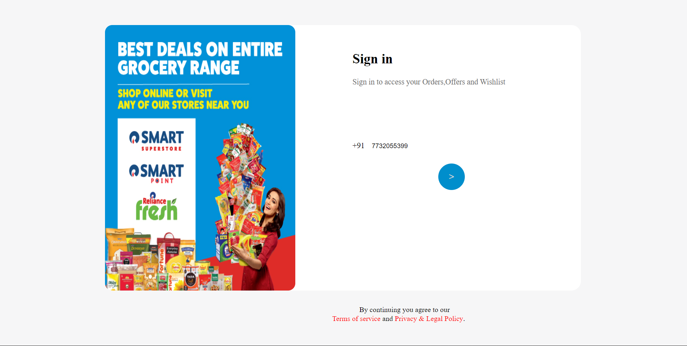
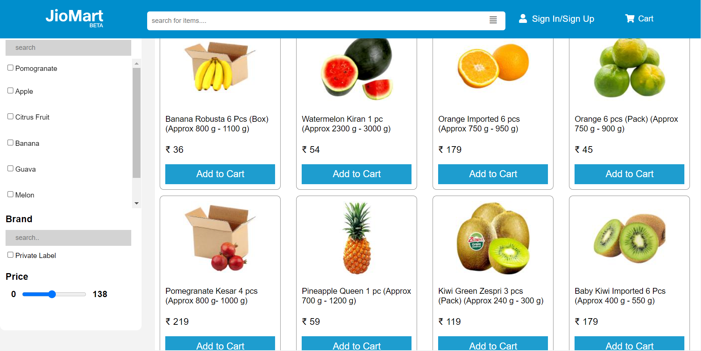
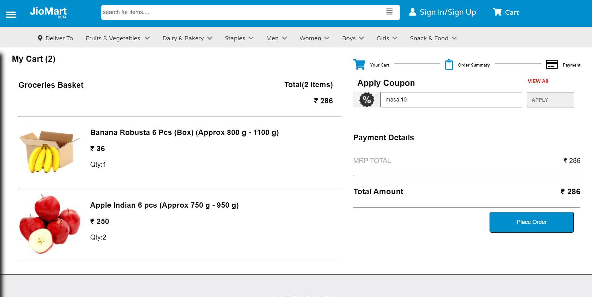
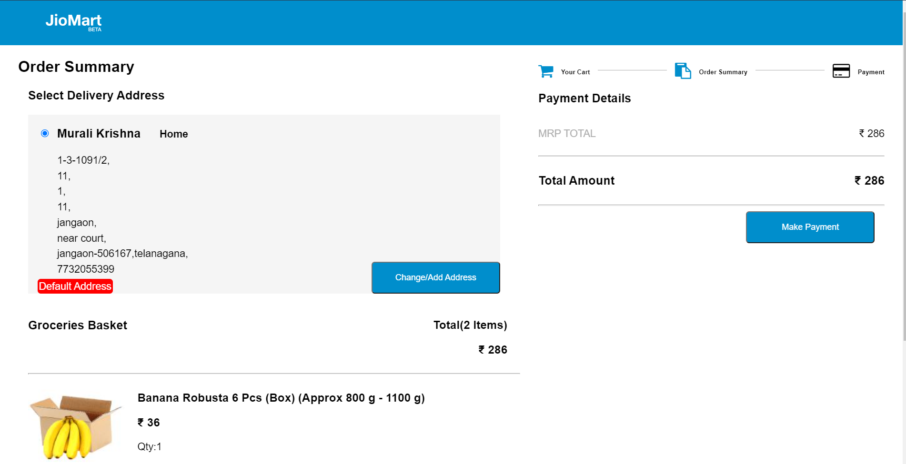
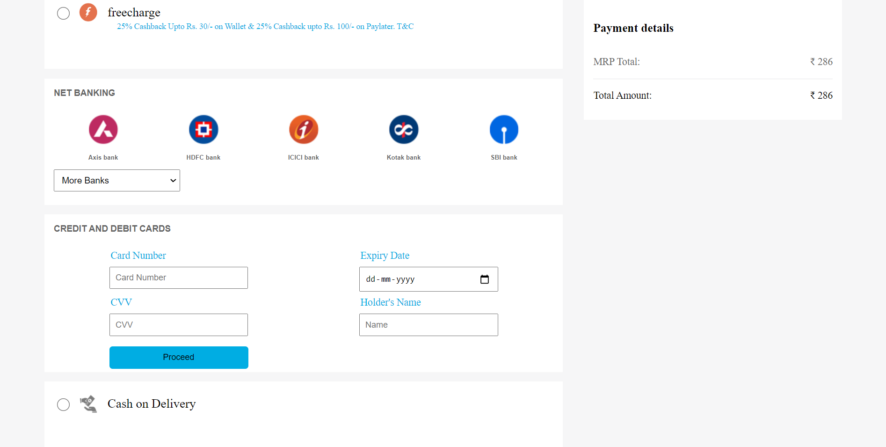

# Jiomart

### Jio Mart is online E-commerce website with wide vareity of items like Grocery, home needs and clothing for all gender groups.

# Authors

- [Murali Krishna](https://github.com/vmk1803)
- [Soumili](https://github.com/Sou156)
- [Mounika](https://github.com/monika-4oop)
- [Sheelu](https://github.com/sheeluofficial)

# Prerequisities

- HTML
- CSS
- JS

# Sceenshots

> HOME PAGE

> SIGN IN PAGE

> PRODUCTS PAGE

> CART PAGE

> ORDER SUMMARY PAGE

> PAYMENTS PAGE

# What did we Learn

- How to be a good Team Player
- Managing code using Git
- Git commands
- Project Presention
